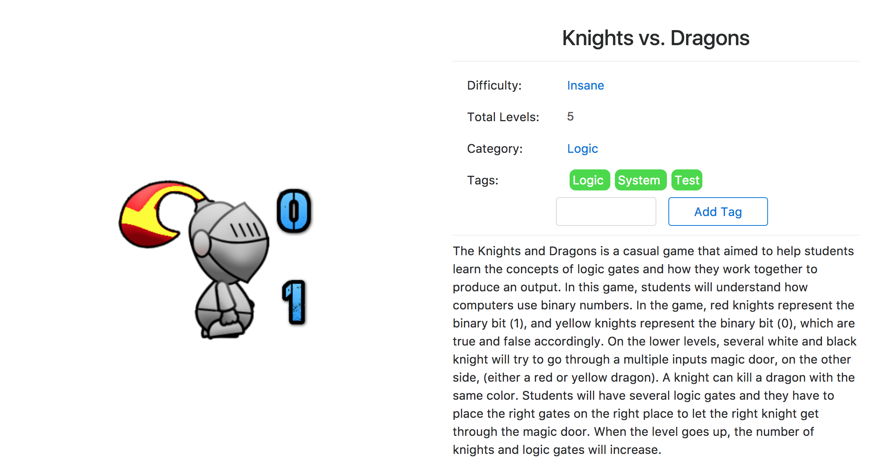
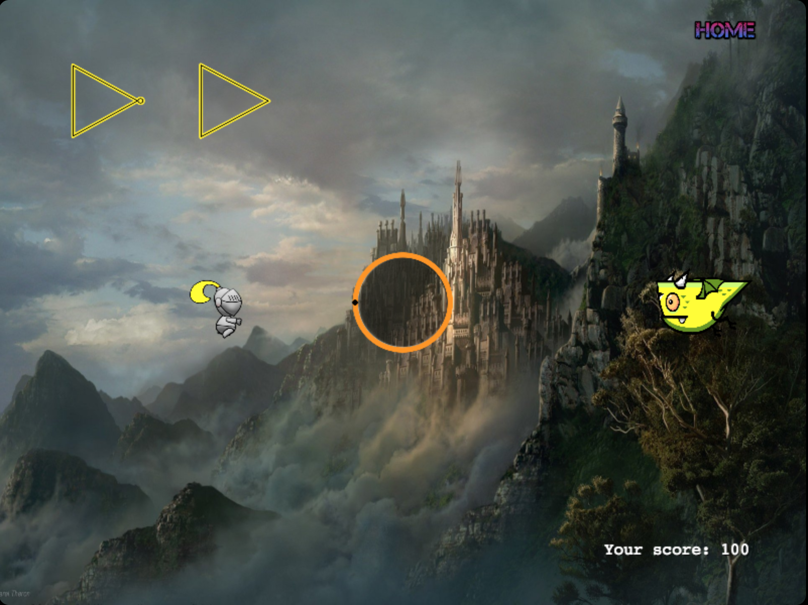
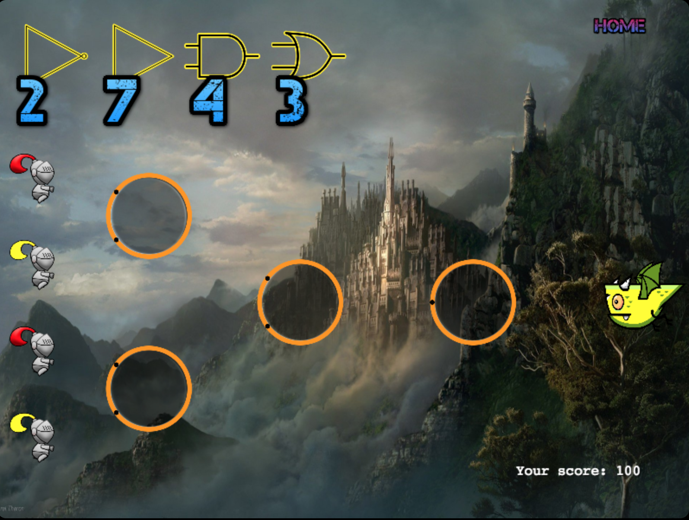
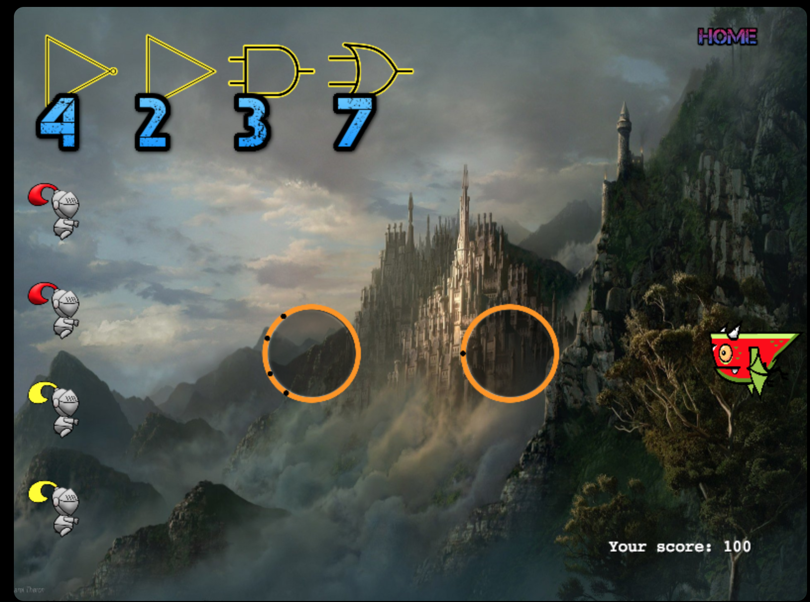
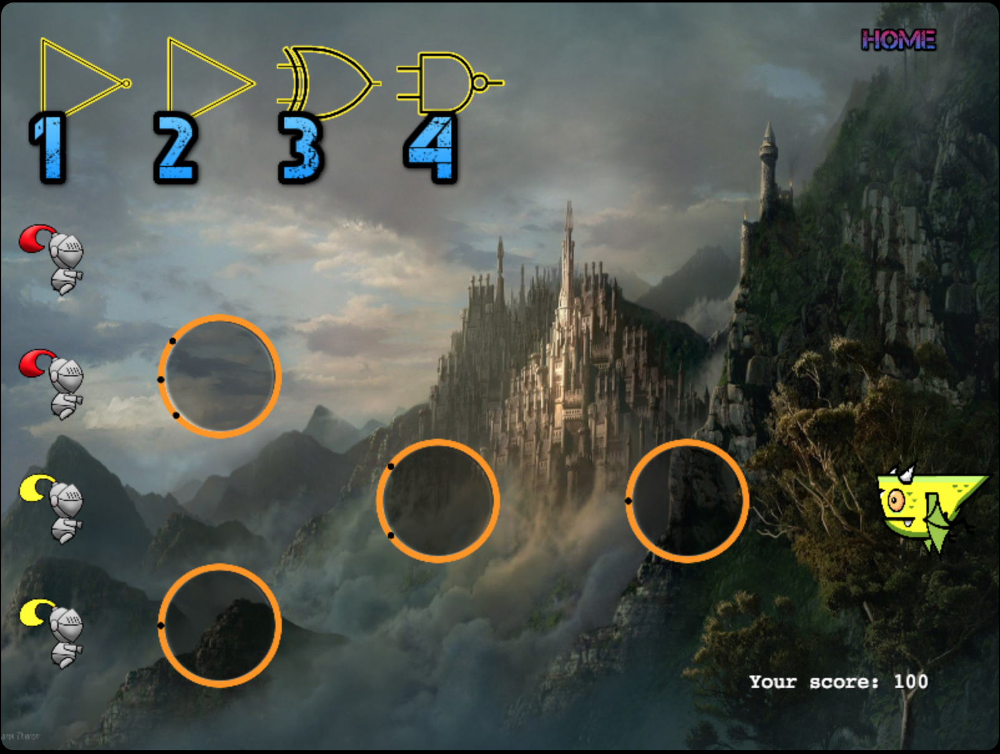
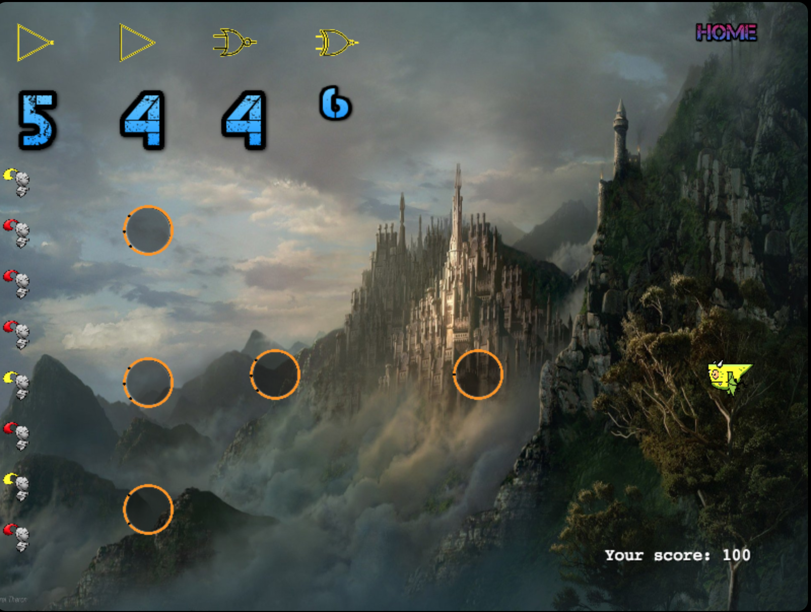

# Knights vs. Dragons

## Intro

A mini game that simulates logic gates, written in JavaScript and Phaser library

## Motivation

This game is one of the inital three games on [Bytes Hunter](https://bytehunter308.appspot.com "Bytes Hunter - A Computer Science Game Plantform")

## Screenshot

### **Level 1**

The starter level. A knight can only beat the dragon with the same color.
The two gates available for this game are {Not, Buffer}.
Tips: Red Knights: represents '1's or 'True' values in computer science Yellow Knights: represents '0's or 'False' values in computer science
Buffer Gate: Accepts one knight at a time and passes through it. NOT Gate: Accepts one knight at a time and converts it to a different color.

### **Level 2**

The four gates available for this game are {Not, Buffer, And, Or}.
Tips: Red Knights: represents '1's or 'True' values in computer science Yellow Knights: represents '0's or 'False' values in computer science
Buffer Gate: Accepts one knight at a time and passes through it.
NOT Gate: Accepts one knight at a time and converts it to a different color.
AND Gate: Accepts multiple knights and ONLY generates a Red Knight (True) when all the inputs are Red Knights (True). It generates a Yellow Knight (False) if there is one Yellow Knight (False) in the inputs.
OR Gate: Accepts multiple knights and generates a Red Knight (True) when there is at least one Red Knight (True) in the inputs. If all inputs are Yellow Knights (False), then it generates a Yellow.

### **Level 3**

This level there are four inputs pass through the same gate, You are free to choose whatever is appropriate.
The four gates available for this game are {Not, Buffer, And, Or}.
Tips: Red Knights: represents '1's or 'True' values in computer science Yellow Knights: represents '0's or 'False' values in computer science
Buffer Gate: Accepts one knight at a time and passes through it.
NOT Gate: Accepts one knight at a time and converts it to a different color.
AND Gate: Accepts multiple knights and ONLY generates a Red Knight (True) when all the inputs are Red Knights (True). It generates a Yellow Knight (False) if there is one Yellow Knight (False) in the inputs.
OR Gate: Accepts multiple knights and generates a Red Knight (True) when there is at least one Red Knight (True) in the inputs. If all inputs are Yellow Knights (False), then it generates a Yellow.

### **Level 4**

Level 4 There will be two new gates for this level.
The four gates available for this game are {Not, Buffer, XOR, NAND}.
Tips: Red Knights: represents '1's or 'True' values in computer science Yellow Knights: represents '0's or 'False' values in computer science
Buffer Gate: Accepts one knight at a time and passes through it.
NOT Gate: Accepts one knight at a time and converts it to a different color.
AND Gate: Accepts multiple knights and ONLY generates a Red Knight (True) when all the inputs are Red Knights (True). It generates a Yellow Knight (False) if there is one Yellow Knight (False) in the inputs.
OR Gate: Accepts multiple knights and generates a Red Knight (True) when there is at least one Red Knight (True) in the inputs. If all inputs are Yellow Knights (False), then it generates a Yellow.
XOR Gate: Accepts multiple knights and evaluate the output recursively. The basic logic is if the inputs are {Red/True, Yellow/False} or vice versa, then it generates a Red (True). Otherwise, the output will be Yellow (False).
NAND Gate: Reverse of AND. Accepts multiple knights and ONLY generates a Yellow Knight (False) when all the inputs are Red Knights (True). It generates a Red Knight (True) if there is one Yellow Knight (False) in the inputs.

### **Level 5**

Level 5 There will be two new gates and more inputs for this level.
The four gates available for this game are {Not, Buffer, NOR, XNOR}.
Tips: Red Knights: represents '1's or 'True' values in computer science Yellow Knights: represents '0's or 'False' values in computer science
Buffer Gate: Accepts one knight at a time and passes through it.
NOT Gate: Accepts one knight at a time and converts it to a different color.
AND Gate: Accepts multiple knights and ONLY generates a Red Knight (True) when all the inputs are Red Knights (True). It generates a Yellow Knight (False) if there is one Yellow Knight (False) in the inputs.
OR Gate: Accepts multiple knights and generates a Red Knight (True) when there is at least one Red Knight (True) in the inputs. If all inputs are Yellow Knights (False), then it generates a Yellow.
XOR Gate: Accepts multiple knights and evaluate the output recursively. The basic logic is if the inputs are {Red/True, Yellow/False} or vice versa, then it generates a Red (True). Otherwise, the output will be Yellow (False).
NAND Gate: Accepts multiple knights and ONLY generates a Yellow Knight (False) when all the inputs are Red Knights (True). It generates a Red Knight (True) if there is one Yellow Knight (False) in the inputs.
NOR Gate: Reverse of OR, Accepts multiple knights and generates a Yellow Knight (False) when there is at least one Red Knight (True) in the inputs. If all inputs are Yellow Knights (False), then it generates a Red (True).
XNOR Gate: Accepts multiple knights and evaluate the output recursively. The basic logic is if the inputs are {Red/True, Yellow/False} or vice versa, then it generates a Yellow (False). Otherwise, the output will be Red (True).

